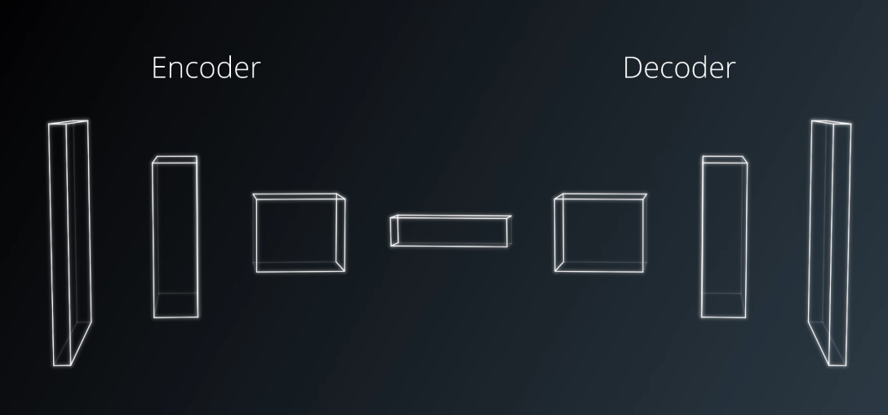

## Follow Me: Deep Learning Project ##

This project trains a deep neural network to identify and track a target in simulation.


### Neural Network Architecture


In this project, we are using a Fully Convolutional Neural Network (FCN) to help us in image segmentation and object identification.

A typical FCN is comprised of multiple encoder blocks, followed by 1x1 convolutional layers, followed by as many decoder blocks. The encoder blocks extract features of the image, the decoder blocks upscale the output back to the size of the original image.

My network layout looks like this:




### Setting the Network Parameters

#### Learning Rate
The learning rate is the amount of correction which the network applies when modifing the weights.

I set the learning rate to 0.001

#### Batch Size

Batch size defines number of samples that going to be propagated through the network.

For our case, 

#### num_epochs
An epoch is a single forward and backward pass of the whole dataset. This is used to increase the accuracy of the model without requiring more data.

Lowering the learning rate would require more epochs, but could ultimately achieve better accuracy.

#### steps_per_epoch
number of batches of training images that go through the network in 1 epoch. One recommended value to try would be based on the total number of images in training dataset divided by the batch_size. 

#### validation_steps
number of batches of validation images that go through the network in 1 epoch. This is similar to steps_per_epoch, except validation_steps is for the validation dataset.

#### workers
maximum number of processes to spin up. This can affect your training speed and is dependent on your hardware.


### Neural Network Constructions

#### Fully Connected Layers


#### 1x1 Convolutional Layers


It is a cheap way to make models deeper and have more parameters, without completely changing their structures.

replacement of fully-connected layers with convolutional layers,  spatial information is preserved.


#### Separable Convolutions

Separable convolutions, also known as depthwise separable convolutions, comprise of a convolution performed over each channel of an input layer and followed by a 1x1 convolution that takes the output channels from the previous step and then combines them into an output layer.

reduces the number of parameters needed, thus increasing efficiency for the encoder network.

For instance, if an input shape of 32x32x3, the desired number of 9 output channels and filters (kernels) of shape 3x3x3. regular convolutions would result in a total of 243 parameters, but with a separable convolutions, a total of 54 (27 + 27) parameters are needed.


#### Bilinear Upsampling
Bilinear upsampling is a resampling technique that utilizes the weighted average of four nearest known pixels, located diagonally to a given pixel, to estimate a new pixel intensity value.


### Results and Discussion


I uploaded a video to youtube. The link is as follows.

[](https://www.youtube.com/watch?v=gE6jEaOTTOU)


```
$ python follower.py my_amazing_model.h5
```

