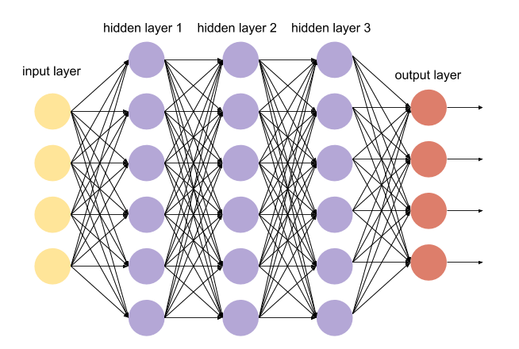

## Follow Me: Deep Learning Project ##

This project trains a deep neural network to identify and track a target in the simulation.

### Neural Network Architecture

In this project, we are using a Fully Convolutional Neural Network (FCN) to help us in image segmentation and object identification.

A typical FCN is comprised of multiple encoder blocks, followed by 1x1 convolutional layers, then followed by decoder blocks. The encoder blocks extract features of the image, the decoder blocks upscale the output back to the size of the original image, the kernel depth is shown in the following figure.

In our case, the network layout has 3 encoder blocks with a 1x1 convolutional layer and 3 decoder blocks. Layer1, layer2, and layer3 are encoded by separable convolutions, the outputs are shown in the following figure. Layer4 is the 1x1 convolutional layer, the size is 20x20x256. Layer4, layer5, and layer6 are decoder layers, each contains sampling the layer, concatenate, and a separable convolution layer, the outputs can also be found in the following figure.


### Setting the Network Parameters

#### Learning Rate
The learning rate is the amount of correction which the network applies when modifying the weights. For our case, I tried from 0.01 to 0.0001 and finally chose 0.001 as the learning rate.

#### Batch Size

Batch size defines the number of samples that going to be propagated through the network. For our case, I set the batch size to 40.

#### num_epochs
An epoch is a single forward and backward pass of the whole dataset. This is used to increase the accuracy of the model without requiring more data. For our case, I set the num_epochs to 60.


#### steps_per_epoch
The steps_per_epoch is the number of batches of training images that go through the network in 1 epoch. One recommended value to try would be based on the total number of images in training dataset divided by the batch_size.  For our case, I set the steps_per_epoch to 200.

#### validation_steps
The validation_steps is the number of batches of validation images that go through the network in 1 epoch. This is similar to steps_per_epoch, except validation_steps is for the validation dataset. For our case, I set the validation_steps to 50.


### Neural Network Constructions

#### Fully Connected Layers

A fully connected layer multiplies the input by a weight matrix and then adds a bias vector. It is useful for image recognition, but the spatial information is lost, so, the spatial information of the images is missing.




#### 1x1 Convolutional Layers

1x1 Convolutional Layer is a neural network layer that is filtered by a 1x1 filter with the step size of one. The advantages of 1x1 Convolutional Layer is that it is a cheap way to make models deeper and have more parameters, without completely changing their structures.

Meanwhile, by replacement of fully-connected layers with convolutional layers,  spatial information is preserved.


#### Separable Convolutions

Separable convolutions, also known as depthwise separable convolutions, comprise of a convolution performed over each channel of an input layer and followed by a 1x1 convolution that takes the output channels from the previous step and then combines them into an output layer. It can reduce the number of parameters needed, thus increasing efficiency for the encoder network.

For instance, if an input shape of 32x32x3, the desired number of 9 output channels and filters (kernels) of shape 3x3x3. regular convolutions would result in a total of 243 parameters, but with separable convolutions, a total of 54 (27 + 27) parameters are needed.

Here is the corresponding code:

```
def separable_conv2d_batchnorm(input_layer, filters, strides=1):
    output_layer = SeparableConv2DKeras(filters=filters,kernel_size=3, strides=strides,
                             padding='same', activation='relu')(input_layer)
    
    output_layer = layers.BatchNormalization()(output_layer) 
    return output_layer
```


#### Bilinear Upsampling
Bilinear upsampling is a resampling technique that utilizes the weighted average of four nearest known pixels, located diagonally to a given pixel, to estimate a new pixel intensity value.


In our case, the corresponding code is:

```
def bilinear_upsample(input_layer):
    output_layer = BilinearUpSampling2D((2,2))(input_layer)
    return output_layer
```

#### Skip Connections

Even if you use an encoder and decoder system, some information has been lost, skip connections are used to retain the missing information. The schematic diagram is as follows:


#### Encoder Block

The encoder blocks take an input image and generate a high-dimensional feature vector. Through the encoder block, the size of the image is reduced, while its depth is enlarged. Here, one depth corresponding the results of one filter, thus extracting the features of the image that corresponds to the filter, the information that unrelated to the filter is removed.

We use separable convolution layers for the encoder block. Here is the corresponding code.

```
def encoder_block(input_layer, filters, strides):
    output_layer = separable_conv2d_batchnorm(input_layer, filters, strides)
    
    return output_layer
```

#### Decoder Block

The decoder block takes in two inputs, one from the previous layer and one from skip connection, it upscales the output back to the size of the original image.

For our case, the decoder block includes an upsampling layer, concatenate layer, and a separable convolution layer. Here is the corresponding code.

```
def decoder_block(small_ip_layer, large_ip_layer, filters):
    output_layer_1 = bilinear_upsample(small_ip_layer)

    output_layer_2 = layers.concatenate([output_layer_1, large_ip_layer])
 
    output_layer = separable_conv2d_batchnorm(output_layer_2, filters)
    
    return output_layer
```

### Results and Discussion

The trained network is tested in simulation, it works well in the simulation. However, the target person tracked in the simulation has different colors compared with other people, so it will be easier compared to real life.

The network should be able to be used for recognizing other objects, but the parameters maybe not the same. There should be new dataset containing the new objects (dog, cat, car, etc.), then using the new dataset and the network to train and tune a new model, finally the new model can be used to recognize the new objects.

I uploaded a video to youtube. The link is as follows.

[](https://www.youtube.com/watch?v=gE6jEaOTTOU)

### Future enhancements

First, this model is trained using default dataset, collect more data from the sim may improve the final score.

Then, maybe making the network deeper yield better results.

Finally, more epochs might improve the performance, but maybe not much.
